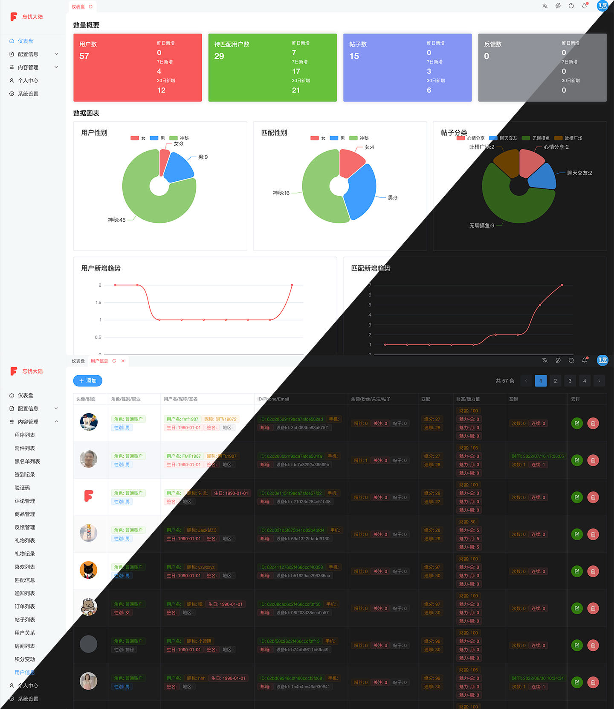

# vmnepentheadmin

使用 ts+vue3+element-plus+vite 进行开发的一套社交项目后台管理系统，具体使用及功能详情看下边介绍

### 界面效果

<div align="center">
    
</div>

### 本地开发调试

```shell
# 安装依赖
$ yarn install
# 开发调试，会监听文件改动重新加载
$ yarn dev

# 更新依赖
$ yarn upgrade-interactive --latest

```

### 发布上线

记得复制`config/.env`一份到 `confi/.env.production` 然后修改里边对应的值为线上配置

```
# 打包编译
$ yarn build
# 规则检查
$ yarn lint
# 打包发布代码
$ tar -czvf ./vmnepentheadmin.tgz -C dist .
# 将打包的代码上传到要发布的服务器上，解包
$ scp vmnepentheadmin.tgz aly:/var/www/vmnepenthe/admin/; rm vmnepentheadmin.tgz
# 解压打包的资源
$ tar -xzvf vmnepentheadmin.tgz .; rm vmnepentheadmin.tgz
# 重启 ngnix
$ /etc/init.d/nginx restart
```

### 功能 TODO

整理下已完成和待完成的功能点

**主题配置功能**

- [x] 固定头部
- [x] 显示底部
- [x] 菜单手风琴效果
- [x] 显示 Logo
- [x] 显示标签
- [x] 标签缓存
- [x] 深色模式
- [x] 灰色模式
- [x] 水印
- [x] 内容切换动画

**其他功能点**

- [ ] 国际化
  - [x] 配置 OK
  - [ ] 翻译待完成
- [x] 菜单搜索

**数据管理**

- [x] 统计面板
- [x] 配置管理，一些有限的数据，供其他数据使用的数据
  - [x] 内容分类
  - [x] 站点配置，这里可以根据需要配置多种数据
    - [x] 客户端参数
    - [x] 用户协议/隐私政策/用户行为规范
  - [x] 职业管理
  - [x] 角色管理
  - [x] 版本配置
- [x] 数据管理
  - [x] 程序列表
  - [x] 附件列表
    - [x] 增删改查
    - [x] 普通数据展示
    - [ ] 附件内容展示
  - [x] 黑名单列表
  - [x] 签到记录
  - [x] 验证码
  - [x] 评论管理
  - [x] 商品管理
  - [x] 反馈管理
  - [x] 用户关系
  - [x] 礼物列表
  - [x] 礼物记录
  - [x] 喜欢数据
  - [x] 喜欢列表
  - [x] 匹配信息
  - [x] 通知列表
  - [x] 订单列表
  - [x] 帖子列表
    - [x] 增删改查
    - [x] 普通数据展示
    - [ ] 附件展示
  - [x] 房间列表
    - [x] 增删改查
    - [x] 普通数据展示
    - [ ] 成员展示
  - [x] 积分变动
  - [x] 用户信息
    - [x] 增删改查
    - [x] 数据展示
- [x] 个人中心
  - [x] 信息编辑
  - [x] 更新邮箱
  - [x] 更新密码
  - [ ] 更新手机号

### 更多

可以看看 [项目整体介绍](https://www.yuque.com/lzan13/fn003n/ypa51f)

**项目客户端下载体验**

- [本地 APK 包下载](http://app.melove.net/fwn)
- [GooglePlay 市场下载](https://play.google.com/store/apps/details?id=com.vmloft.develop.app.nepenthe)

**开源仓库地址**

- [gitee/VMTemplateAndroid](https://gitee.com/lzan13/VMTemplateAndroid) Android 客户端
- [gitee/vmtemplateadmin](https://gitee.com/lzan13/vmtemplateadmin) 管理端项目使用`vue3`+`vite`+`element-plus`
- [gitee/vmtemplatehome](https://gitee.com/lzan13/vmtemplatehome) 首页端项目使用`vue3`+`vite`
- [gitee/vmtemplateserver](https://gitee.com/lzan13/vmtemplateserver) 服务器端项目使用`eggjs`

- [github/VMTemplateAndroid](https://github.com/lzan13/VMTemplateAndroid) Android 客户端
- [github/vmtemplateadmin](https://github.com/lzan13/vmtemplateadmin) 管理端项目使用`vue3`+`vite`+`element-plus`
- [github/vmtemplatehome](https://github.com/lzan13/vmtemplatehome) 首页端项目使用`vue3`+`vite`
- [github/vmtemplateserver](https://github.com/lzan13/vmtemplateserver) 服务器端项目使用`eggjs`

**沟通交流**

可以通过已下方式找到我，获取最新信息，以及技术支持

公众号: 穿裤衩闯天下

<div align="center">
    
</div>

QQ 群: 901211985 个人 QQ: 1565176197

<div align="center">
    
    
</div>

**支持赞助**

如果你觉得当前项目帮你节省了开发时间，想要支持赞助我的话 👍，可以扫描下方的二维码打赏请我吃个鸡腿 🍗，你的支持将鼓励我继续创作 👨‍💻‍，感谢 ☺️ [赞助列表](./sponsor.md)

<div align="center">
    
    
</div>

### LICENSE

[MIT License Copyright (c) 2022 lzan13](./LICENSE)

## 配置参考

[Configuration Reference](https://cli.vuejs.org/zh/config/).
